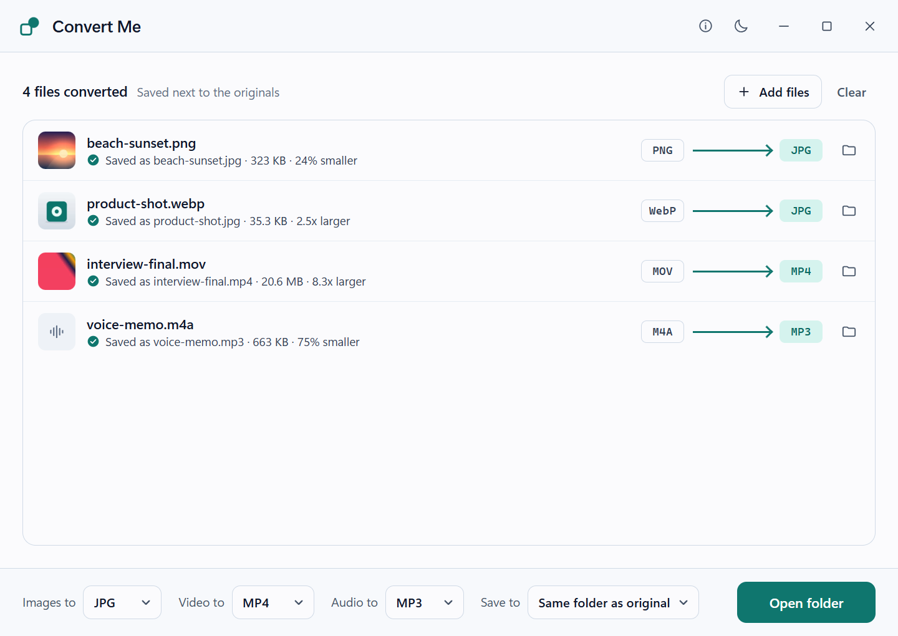

# Convert Me

Convert images, audio and video on your own Windows PC. Drop files in, pick a format,
and press Convert. Nothing is uploaded, there is no account, and the app works with the
network cable unplugged.



## What it reads and writes

| Kind | Reads | Writes |
| --- | --- | --- |
| Images | JPG, PNG, WebP, GIF, BMP, TIFF | JPG, PNG, WebP, GIF, BMP, TIFF |
| Video | MP4, MOV, MKV, WebM, AVI, WMV, MPG, TS | MP4, MOV, MKV, GIF, or audio only |
| Audio | MP3, WAV, FLAC, M4A, AAC, OGG, Opus, WMA, AIFF | MP3, M4A, WAV, FLAC |

The same table is on the first screen of the app. It is generated from the list the
converter itself uses, and every combination in it is converted for real, and checked,
each time the app is built.

"Audio only" pulls the sound out of a video as MP3, M4A, WAV or FLAC.

### What you get

- **JPG**: high quality. Transparent areas become white, because JPG has no transparency.
- **PNG, BMP, TIFF**: lossless. TIFF uses LZW compression. BMP gets a white background too.
- **WebP**: quality 85, keeps transparency.
- **GIF** from a picture: up to 256 colors. From a video: 12 frames per second, at most
  480 pixels wide, looping.
- **MP4, MOV, MKV**: H.264 video with AAC sound, which plays almost everywhere. When the
  video is already H.264 it is copied as it is, which takes seconds and loses nothing.
- **MP3**: variable bit rate, around 190 kbps. Surround sound is mixed down to stereo.
- **M4A**: AAC at 192 kbps for stereo.
- **WAV, FLAC**: 16-bit, or 24-bit when the source has more than 16 bits.

Photos that are stored sideways (most phone photos) come out the right way up.

### What it cannot do yet

- **AV1 video, HEIC photos and animated WebP** cannot be read. The app says so on the row.
- **No WebM, AV1 or OGG output.**
- **HDR video** converts, but colors can look flat. The app warns you before you start.
- **Copy-protected files** (DRM) cannot be converted.
- **Folders** cannot be added as a whole yet. Open the folder and drop the files in it.
- Only the first video track and the first audio track are converted. Subtitles and
  chapters are left out.
- Video larger than 4096 x 2304 is scaled down to fit, so the result plays everywhere.
- A file that is already in the chosen format is skipped, because converting it again
  would only make a second, slightly worse copy.

## Your files are safe

- **Originals are never changed.** The app only reads them.
- **Nothing is overwritten unless you say so.** If a file with the new name already
  exists, the app asks first. "Keep both" saves the new file as `name (1).jpg`.
  An original is never replaced, whatever you choose.
- While a file is being converted it has a temporary name that ends in
  `.convertme-part`. It gets its real name only after the result has been checked.
  If you cancel, close the app, or the power goes out, the unfinished file is removed
  (or, after a power cut, is safe to delete).

See [PRIVACY.md](PRIVACY.md) for exactly what the app stores, and what it does not.

## Install and run

1. Unzip `ConvertMe-0.1.0-windows-x64.zip` anywhere you like.
2. Open `ConvertMe.exe`.

There is no installer and nothing is added to Windows. To remove the app, delete the
folder. Keep `ConvertMe.exe` and the `runtime` folder together: the app checks the two
files in it every time it starts and will not run with a changed or missing engine.

You can also drag files onto `ConvertMe.exe`, or use **Open with** in Explorer, and they
show up in the list.

**Needs:** Windows 10 version 22H2 or Windows 11, 64-bit. About 45 MB of disk space.

- The interface uses Microsoft Edge WebView2, which is already part of Windows 11 and of
  up-to-date Windows 10. If it is missing, the Microsoft installer inside the app
  downloads it once. That is the only time anything is downloaded.
- MP4, MOV and MKV use the H.264 encoder that comes with Windows. Windows N editions
  need the free Media Feature Pack for it. Without it those three formats are greyed out,
  with the reason, and everything else still works.

### This build is not code signed

Windows may warn about an unknown publisher the first time you open it. Signing needs a
certificate from the owner of the app. `SHA256SUMS.txt` lets you check that a download
was not changed on the way, but a checksum does not prove who made it.

## How it works

The conversion engine is [FFmpeg](https://ffmpeg.org/) 8.1.3. It ships next to the app as
two programs, `runtime\ffmpeg\bin\ffmpeg.exe` and `ffprobe.exe`. They are built from
unmodified source by the scripts in this repository, with only the formats above, under
the LGPL license, and without any network code at all. H.264 video is encoded by
Windows itself, so no H.264 encoder is included.

The app starts the engine directly with a list of arguments. No command line is ever
put together from file names, so a file called `-i %03d & more.png` is just a file.
Video conversions run at a slightly lower priority, so the PC stays usable.

See [THIRD-PARTY-NOTICES.md](THIRD-PARTY-NOTICES.md) for the licenses and for the source
code of the engine.

## Build from source

You need Windows x64 with:

- PowerShell 7.2 or later
- Go, the version in `go.mod` (Go downloads the right toolchain by itself)
- Node.js 22.12 or later, with npm
- Wails CLI 2.15.0
- Git for Windows (for its Bash)
- A MinGW-w64 GCC toolchain with `mingw32-make`, CMake and NASM. The tested one is the
  toolchain that comes with Strawberry Perl: GCC 13.2.0.
- Microsoft Edge, used by the interface tests

The build scripts install nothing on your system. Everything they download or make stays
inside this folder.

```powershell
.\scripts\build.ps1
```

That one command does all of this, and stops at the first problem:

1. Downloads the pinned source of FFmpeg, zlib, libwebp and LAME, checks each SHA-256,
   and builds the engine (about 15 minutes the first time, then cached).
2. Checks the engine: LGPL only, local files only, no extra DLLs, exactly the expected
   encoders.
3. Converts every test file in `scripts\fixtures` to every format the app offers, about
   280 real conversions, and checks each result. Pictures are read back with decoders
   that have nothing to do with the engine.
4. Runs the interface tests and the Go tests.
5. Builds `ConvertMe.exe` and packages it.

The result:

```text
dist\ConvertMe-0.1.0-windows-x64\          the app, ready to run
dist\ConvertMe-0.1.0-windows-x64.zip       the same, zipped
dist\ConvertMe-0.1.0-native-source.zip     source and build recipe of the engine
dist\SHA256SUMS.txt
```

If you pass the app on to someone, pass the native-source zip on as well. The license
of the engine asks for that.

Useful pieces on their own:

```powershell
.\scripts\prepare-runtime.ps1             # build and check the engine only
.\scripts\test-native.ps1 -Detailed       # real conversions with the engine
cd frontend; npm test; npm run test:e2e   # interface logic and interface tests
go test ./...                             # Go tests (real conversions are skipped here)
python .\scripts\make-fixtures.py         # regenerate the test files (needs a full FFmpeg on PATH)
```

The same compiler versions give the same engine. Byte-identical results with other
versions are not promised.

### The packaged version, with the right-click entry

The packaged version of the app adds **Convert with Convert Me** to the right-click menu
of File Explorer. `scripts\package-msix.ps1` makes the package from the app that
`scripts\build.ps1` has just built. It needs the Windows SDK and the Microsoft C++ build
tools. The file `docs\explorer-context-menu.md` in the repository says how the entry
works, what was checked, and how to remove the test package again.

```powershell
.\scripts\package-msix.ps1                # put the test package together (registers nothing)
.\scripts\register-test-package.ps1       # add it to Windows, for your user only
.\scripts\register-test-package.ps1 -Remove
```

The test package has a development identity and needs Developer Mode. It cannot go to
the Microsoft Store.

A package for the Store must carry the identity that Partner Center gave the product.
Copy the five values exactly from Partner Center (Product management > Product identity,
and the reserved product name) into a JSON file that you keep outside this repository:

```json
{
  "identityName": "Publisher.ProductName",
  "publisher": "CN=00000000-0000-0000-0000-000000000000",
  "publisherDisplayName": "Publisher name",
  "displayName": "The reserved product name",
  "packageFamilyName": "Publisher.ProductName_0000000000000"
}
```

```powershell
.\scripts\package-msix.ps1 -StoreIdentity C:\somewhere\store-identity.json
```

The result is `dist\ConvertMe-0.1.0-windows-x64-store.msix`, with a receipt of its hashes
next to it. Good to know:

- The app version 0.1.0 is the package version 1.1.0.0. A package version cannot start
  with 0, and the Store keeps the fourth number for itself.
- The package is not signed. That is what the Store asks for: it signs the package it
  publishes.
- The package carries the source of the engine in its `source` folder.
- The script unpacks the finished package again and compares every file. It uploads
  nothing.

## License

Convert Me is MIT licensed, Copyright 2026 Burke Holland. See [LICENSE](LICENSE).
The engine and the other third-party parts keep their own licenses.
